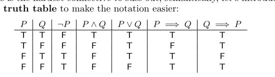

type:: blog
public:: true
category:: math
sub-category:: logic

- 虽然这个逻辑学过好几次，但是过一段时间又会忘记，猛一看，发现自己又不懂逻辑了，这次看的是 [Everything You Always Wanted To Know About Mathematics](https://www.math.cmu.edu/~jmackey/151_128/bws_book.pdf )  书中第四章的一些笔记
- Definition 4.2.1. A **mathematical statement** (or **proposition** or **logical statement**) is a grammatically correct sentence (or string of sentences), composed of English words/symbols and mathematical symbols that has exactly one truth value, either **True** or **False**.
- **The Law of the Excluded Middle**
	- 任何一个数学命题只能为**True**  or  **False**
- ### Conditional Statements
	- $\text{If P then Q 或者 P } \Rightarrow Q$
	- 
	- 语句 "If you work hard, then you will get an A in this course", 其中 P 为 "You work hard"， Q 为 "You will get an A"。通过判断我在说这句话的时候是不是 `liar` ,如果我是 `liar` 表示这句话是 `false` ，如果我不是 `liar` 表示这句话是 `true`。
	- 那么分析什么时候是 `liar`：
		- If you do work hard and don't get an A. 这是唯一为false的情况，其他三种情况都不能说我是 `liar`
		- If you do work hard and do get an A. 这是True的，符合命题
		- If you don't work hard and don't get an A. 以下两种情况我们的命题根本没有提到如果你不努力工作的情况，是否可以得到A，所以命题为 True
		- If you don't work hard and do get an A.
	- 唯一为 Fasle 的情况是在条件 P 的为 True时， Q 为 False，说明该命题为 False的
	- When we know P is True and can deduce that Q is also True, then we get to declare $P \Rightarrow Q$ as **True**. If P wasn’t true to begin with, we cannot declare $P \Rightarrow Q$ to be **False**. We only get to say $P \Rightarrow Q$ is false when Q did not necessarily follow from P , i.e. when there is an instance where the hypothesis P is **True** but the conclusion Q is **False**.
	  background-color:: red
- 后面找时间系统学习一下数理逻辑
-