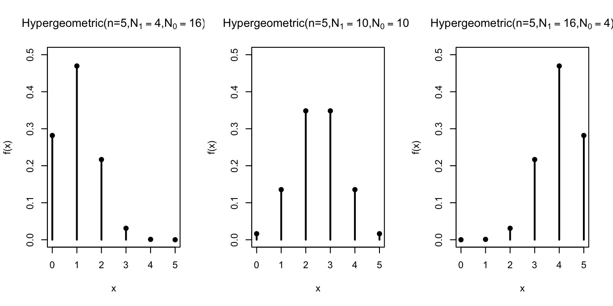
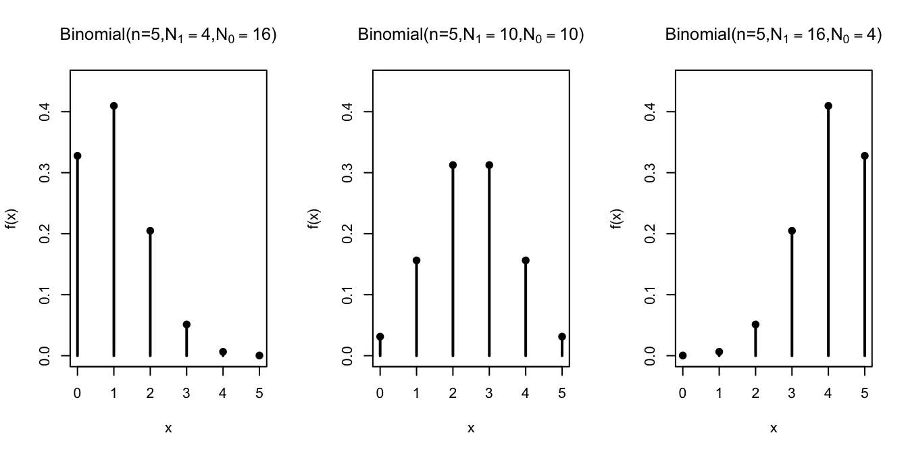
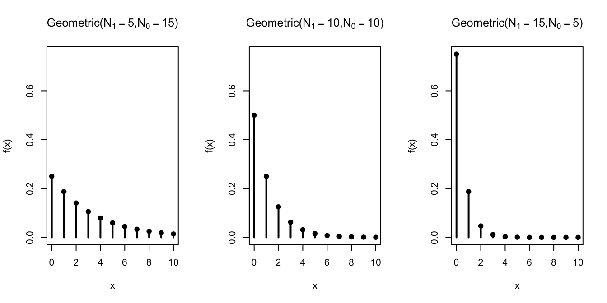

public:: true
type:: blog
category:: probability
sub-category::

- 资料来源 https://dlsun.github.io/probability
- ## Hypergeometric Distribution
- If a random variable can be described as the number of $➀$'s in $n$ random draws, without replacement, from the box
  $$
  \begin{aligned}
  \overbrace{[\underbrace{⓪...⓪}_{N_0}\underbrace{➀...➀}_{N_1}]}^N,
  \end{aligned}
  $$
  then its p.m.f. is given by
  $$
  \begin{aligned}
  f\left(x\right)=P\left(X=x\right)=\frac{{N_0\choose x}{N_1\choose n-x}}{{N\choose n}},x=0,...,n,
  \end{aligned}
  $$
  where $N = N_1 + N_0$ is the number of tickets in the box.
- 
- ## Binomial Distribution
- 在一个包含 $N_0$ 个 $⓪$ 球, $N_1$ 个 $➀$ 球中，在 $n$ 次放回球的抓取中，拿到 $x$个 $➀$ 球的几率
- If a random variable can be described as the number of $➀$'s in n random draws, with replacement, from the box
  $$
  \begin{aligned}
  \overbrace{[\underbrace{⓪...⓪}_{N_0}\underbrace{➀...➀}_{N_1}]}^N,
  \end{aligned}
  $$
  then its p.m.f. is given by
  $$
  \begin{aligned}
  f\left(x\right)=P\left(X=x\right)=\frac{{n\choose x}\cdot{N_1}^x\cdot{N_0}^{n-x}}{N^n},x=0,...,n,
  \end{aligned}
  $$
  also can be written as
  $$
  \begin{aligned}
  f\left(x\right)=P\left(X=x\right)={n\choose x} \cdot p^x \cdot (1-p)^{n-x},x=0,...,n,
  \end{aligned}
  $$
  where $p=N_1/N$ is the proportion of $➀$'s in the box.
- {:height 397, :width 778}
- ## Geometric Distribution
- If a random variable can be described as the number of draws, with replacement, from the box
  $$
  \begin{aligned}
  \overbrace{[\underbrace{⓪...⓪}_{N_0}\underbrace{➀...➀}_{N_1}]}^N,
  \end{aligned}
  $$
  until a $➀$' is drawn, then its p.m.f. is given by
  $$
  \begin{aligned}
  f\left(x\right)=P\left(X=x\right)=\frac{{N_0}^{x-1}\cdot{N_1}}{N^x},x=0,...,n,
  \end{aligned}
  $$
  also can be written as
  $$
  \begin{aligned}
  f\left(x\right)=P\left(X=x\right)=(1-p)^{x-1} \cdot p,x=0,...,n,
  \end{aligned}
  $$
  where $p=N_1/N$ is the proportion of $➀$'s in the box.
- 
-
- ## Negative Binomial Distribution
- 在一个包含 $N_0$ 个 $⓪$ 球, $N_1$ 个 $➀$ 球中，在 $x$ 次放回球的抓取中，拿到 $r$个 $➀$ 球的几率
- If a random variable can be described as the number of draws, with replacement, from the box
  $$
  \begin{aligned}
  \overbrace{[\underbrace{⓪...⓪}_{N_0}\underbrace{➀...➀}_{N_1}]}^N,
  \end{aligned}
  $$
  until r $➀$' is drawn, then its p.m.f. is given by
  $$
  \begin{aligned}
  f\left(x\right)=P\left(X=x\right)=\frac{{x-1\choose r-1}\cdot{N_{0}}^{x-r}\cdot {N_1}^r}{N^x},x=0,...,n,
  \end{aligned}
  $$
  where $N = N_1 + N_0$ is the number of tickets in the box.
  also can be written as 
  $$
  \begin{aligned}
  f\left(x\right)=P\left(X=x\right)={x-1\choose r-1} \cdot (1-p)^{x-1} \cdot p,x=0,...,n,
  \end{aligned}
  $$
  where $p=N_1/N$ is the proportion of $➀$'s in the box.
- 
- ## Poisson Distribution
- Question: You are in a room of $n$ people (including yourself). Each person in the room has contributed $1 to a central pot, so there is a total of $$n$ in the pot. The money in the pot will be redistributed back to the people in the room, in the following way: each dollar is equally likely to go to any one of the $n$ people, independently of the other dollars in the pot. This means that some people could get more than $1, while others end up with nothing.
  As $n\to\infty$, **what is the probability that you end up with no money?**
- 利用二项式分布模型来理解这个问题，二项式分布在盒模型的情况是指 $n$ 次放回抽取小球时，拿到编号为 $1$ 的个数，那么上面这个问题我们可以理解编号为  $1$ 的球是我们拿到 $1 ，而其他的球的都是我们没有，但在这个问题中  $n$ 次抽取是在 $n$ 个球中抽取。
- Let $X$ be a $Binomial(n,p=\frac{\mu}{n})$ random variable, where $\mu$ is a constant. Then, as $n\to\infty$, the p.m.f. of $X$ approaches
  $$
  \begin{aligned}
  f\left(x\right)=e^{-\mu}\cdot\frac{\mu^{x}}{x!}, x = 0,1,2,...
  \end{aligned}
  $$
  A random variable with above as its p.m.f. is said to follow a $Poisson(\mu)$ distribution.
- 详细的证明过程 https://medium.com/@andrew.chamberlain/deriving-the-poisson-distribution-from-the-binomial-distribution-840cc1668239
- 
-
-