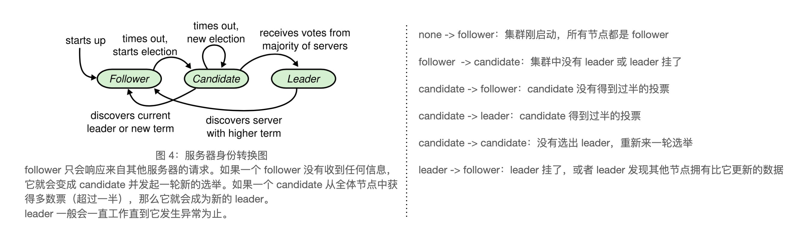

public:: true
category:: programming
sub-category:: 分布式
type:: blog
date:: [[Nov 22nd, 2023]]

- 分布式存储在解决数据安全的技术难点后，又引入了一个新的技术问题，就是如何保障多个副本中的数据一致性。**TiDB 最底层用Raft 来同步数据**。 每次写入都要写入多数副本，才能对外返回成功，这样即使丢掉少数副本，也能保证系统中还有最新的数据。 也就是说如果你能把mysql数据副本同步到其他机器上，然后对外提供和mysql一致的服务，那么你就实现了一个分布式数据库
- 
- 拜占庭错误：
- 子模块：
	- Learder选举
		- 保持Leader一直存在
	- 日志复制
		- Leader 必须接收来自客户端的日志条目然后复制到集群的其他节点，并且强制其他节点的日志和自己的保持一致
	- 安全性
		- **日志一致性**，只要有任何服务器节点将一个特定的日志条目应用到它的状态机中，那么其他服务器节点就不能在同一个日志索引位置上存储另外一条不同的指令。
	- 成员变更
- 确定性和不确定性
	- 减少状态机的状态数量增加确定性
	- Leader Election 算法，使用不确定性，随即触发选举时间来解决
- 节点身份：
	- Leader
		- 处理所有来自客户端的请求(如果一个客户端和Follower通信，Follower会将请求重定向到Leader上）
		- Leader 会一直工作直到出现问题
	- Follower
		- 都是被动式的，他们不会发送任何请求，只是简单的响应来自Leader和Candiate的请求。
	- Candidate
		- 用来选举新Leader时出现的临时状态
	-
- 
- Term 任期，Raft中的重要概念
	- Raft会保证在任意一个任期内都只有一个Leader。
	- 在某些情况下，一个节点可能没有观察到Leader选举过程甚至整个任期过程
	- 任期还在Raft中扮演一个逻辑时间(Logical clock)角色，这使得服务器可以以发现一些国企的信息，例如过时的Leader
	-
-
-
-
-
-
-
-
-
-
-
-
-
-
-
-
-
-
-
-
-
-
-
-
-
-
-
-
-
- 
-
-
-
-
-
-
-
-
-
-
-
-
-
-
-
-
-
-
-